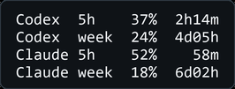

# ai-fuelgauge

> Peek at your AI subscription fuel gauge — remaining quota for OpenAI Codex + Anthropic Claude, side by side.

**English** · [繁體中文](./README.zh-TW.md)

## Disclaimer — please read before using

This repository is source code for a **personal** AI-subscription quota viewer,
published for transparency and technical reference rather than as a product. It
relies on **consumer OAuth behaviour and undocumented API endpoints** that may
change, break, or fall outside provider-supported usage at any time. It is not an
official, supported, or recommended client for OpenAI or Anthropic. Anthropic's
documentation states that consumer OAuth is intended for native Anthropic
applications; this tool sits outside that clearly-blessed path. If you choose to
run or adapt it, you do so at your own risk and should review the code, the API
behaviour, and the Terms of Service that apply to your own account.

The project is intentionally **not published on PyPI** — `git clone` only, from
this repository.

## Why it exists

I pay for both a ChatGPT subscription (for Codex) and a Claude subscription
(for Claude Code). To check remaining quota, I was bouncing between different
interfaces — ChatGPT and Claude desktop apps, web dashboards, and Claude Code's
`/usage` command. I wanted one glance instead. This is the tool I built for
myself; the source is public in case it's useful as a reference.

A small cross-platform Python CLI that shows how much of your 5-hour and
weekly rate-limit windows you've already burned through, for both
subscriptions at once. Optional system-tray mode with threshold notifications.

## Example output

```
Codex
  5h         29%  [========>                     ]  reset 3h03m
  week       25%  [=======>                      ]  reset 5d17h

Claude
  5h         29%  [========>                     ]  reset 1h35m
  week       15%  [===>                          ]  reset 15h35m
```

Colors: green &lt; 70 %, orange 70–89 %, red ≥ 90 %.

## Run from source

```bash
git clone https://github.com/k7631159/ai-fuelgauge.git
cd ai-fuelgauge
```

Everything else is standard library — no install needed for the CLI.
For tray mode, install extra deps:

```bash
pip install --user -r requirements-tray.txt
```

There is no PyPI package on purpose (see Disclaimer). `pip install git+https://...`
is technically possible but not recommended for casual use.

## Usage

### CLI (one-shot glance)

```bash
python ai_fuelgauge.py                 # plain output
python ai_fuelgauge.py --json          # machine-readable JSON (raw probe state;
                                       # stale bars not merged — see note below)
python ai_fuelgauge.py --no-cache      # bypass result cache (auth safety
                                       # check may still skip the network)
python ai_fuelgauge.py --debug         # dump raw API responses
```

`--json` emits the raw probe state. When the Claude token has expired,
the human-readable CLI / tray will additionally render last-known-good
stale bars, but those are not merged into the JSON payload — JSON
consumers see the same probe error fields and can read
`~/.cache/usage-quota-last-claude.json` directly if they want the
stale snapshot.

Wrap it in a shell alias (Windows `usage.cmd` / Linux `usage` symlink) so you
can just type `usage`.

### Tray app (always-visible)

```bash
python ai_fuelgauge.py --tray          # runs until you right-click → Quit
python ai_fuelgauge.py --tray --interval 600   # poll every 10 min
python ai_fuelgauge.py --hud           # standalone HUD path; tray is recommended
```

On Windows, tray and HUD modes relaunch themselves with `pythonw.exe` so the
floating UI does not keep a black console window open. Add `--no-detach` when
you want to keep stderr visible for debugging.

The tray icon shows a coloured dot reflecting your highest utilization across
both subscriptions. Right-click for the detailed menu and a **Refresh now**
option. A desktop notification fires when:

- 5-hour window hits 80 %
- Weekly window hits 90 %

Claude auth failures show distinct tray labels — `auth` (refresh failed,
run `claude`), `expired` (proactive skip, run `claude`), or `envtok`
(replace `$CLAUDE_CODE_OAUTH_TOKEN`) — with menu text explaining the
fix without you having to dig into logs. When the token has expired
but a successful Claude probe from the last 24 h is on file, the tray
keeps showing those numbers tagged as stale; rolled-over windows are
omitted explicitly, and an extra menu row carries the recovery action.

The tray menu can also show/hide a small floating HUD, and the tray remembers
that choice for the next launch. The HUD starts compact with Codex 5h + Claude
5h; click it once to expand to Codex 5h/week + Claude 5h/week, and click again
to return to compact. Drag the HUD to move it; the position is remembered. Use
the mouse wheel over the HUD to adjust opacity, or right-click the HUD for
Refresh / Toggle / Opacity presets / Quit. The HUD is another view of the tray
quota state: normal updates render the tray snapshot, and HUD Refresh asks the
tray to fetch before redrawing instead of running an independent probe loop.
Only one HUD instance runs at a time, so a standalone HUD and tray-owned HUD
cannot stack duplicate overlays.



Notifications use Windows toast (`winotify`) or `plyer` elsewhere.

## Support matrix (v0.3.0)

| Environment | CLI | Tray | Notes |
|---|---|---|---|
| Windows 10/11 + ChatGPT Plus + Claude Max | ✅ tested | ✅ tested | author's daily driver |
| Windows + Pro / Max | ✅ expected to work | ✅ expected to work | same endpoints & JSON-RPC |
| macOS + Plus/Pro/Max | ⚠️ untested | ⚠️ untested | macOS Keychain path is coded but not verified — feedback wanted |
| Linux + any | ⚠️ untested | ⚠️ untested | GNOME Shell no longer shows trays by default |
| Any OS + ChatGPT Business/Enterprise | ⚠️ partial | ⚠️ partial | token-credit plans show credit balance instead of 5h/weekly bars |
| Any OS + Claude Team/Enterprise | ❌ likely unsupported | — | OAuth usage endpoint may behave differently for org plans |
| Any OS + Anthropic API-key (not subscription) | ❌ unsupported | — | API keys don't use consumer OAuth — different flow needed |

If you try it on an untested combination, please open an issue with the output
of `python ai_fuelgauge.py --debug --json`. **Before posting**: `--debug` dumps
the raw OAuth usage-endpoint response, which can include account-level fields —
redact anything you don't want in a public issue.

## How it works

### Codex side — experimental Codex CLI interface

Spawns `codex app-server` as a subprocess and sends a JSON-RPC request:

```json
{"jsonrpc":"2.0","method":"account/rateLimits/read","params":{}}
```

This method is defined in the Codex CLI's own protocol schema (generated via
`codex app-server generate-json-schema`). The `app-server` command is marked
`[experimental]`, so it may change — but because it's maintained by the Codex
team alongside the CLI, it's more stable than reverse-engineering HTTP endpoints.

### Claude side — undocumented OAuth endpoint

Reads Claude Code OAuth credentials and checks the local `expiresAt` before
probing. If the token is healthy, calls
`GET https://api.anthropic.com/api/oauth/usage` with the header
`anthropic-beta: oauth-2025-04-20`; the endpoint returns structured JSON with
`five_hour` and `seven_day` blocks (utilization + reset timestamps) that the
tool maps onto the 5h / weekly bars.

If the token is expired or within 60 s of expiry, the tool asks the local
`claude` CLI (`claude auth status`) to refresh it first. If refresh does not
produce a new, non-expired token, **no network request is made** and a local
auth error is shown — this protects shared upstream limits from being hit
with a known-bad bearer. The local error reuses utilization/reset fields
from the most recent successful probe (if any) as stale bars, capped at
24 h; schema mismatch, clock skew, or rolled-over windows fall back to a
plain "expired, run `claude`" hint.

The endpoint is **not documented in Anthropic's public API docs** and is
reserved for native Anthropic applications. This tool consumes it for
**personal use only**; it is not a sanctioned integration path and could stop
working at any time. No API tokens are consumed by the probe — the OAuth
endpoint is not billed against the model rate-limit budget.

### Credential resolution order (Claude)

1. `$CLAUDE_CODE_OAUTH_TOKEN` environment variable (direct token)
2. `$CLAUDE_CONFIG_DIR/.credentials.json`
3. `~/.claude/.credentials.json`
4. macOS Keychain service `Claude Code-credentials`

### Cache

Two caches sit in `~/.cache/`:

- `usage-quota.json` — 30-second result cache that skips the Codex
  `app-server` cold-start (~4 s per spawn) on back-to-back `usage` calls,
  and is a courtesy to the OAuth usage endpoint. `--no-cache` bypasses
  this layer; Claude's auth safety check may still skip the network when
  the local token is expired and can't be refreshed.
- `usage-quota-last-claude.json` — last successful Claude probe, kept up
  to 24 h, used only when the token has just expired so the UI can render
  stale bars instead of a bare "expired" placeholder. `--no-cache` does
  **not** bypass this layer; the next successful probe overwrites it.

## Known limitations

- The Anthropic OAuth usage endpoint is **undocumented** and reserved for
  native Anthropic apps; a future change could break the Claude side silently.
- The Codex `app-server` protocol is **experimental**; a future Codex release
  could rename the method.
- Linux tray support depends on your desktop environment. Upstream GNOME no
  longer shows system-tray icons; try an extension like *AppIndicator Support*.
- `$CLAUDE_CODE_OAUTH_TOKEN` is treated as a static token and cannot be
  auto-refreshed; rotate it manually (or unset it to fall back to the
  credentials file) when it expires.
- Claude auto-refresh requires the `claude` CLI on `PATH` and able to
  rewrite Claude Code credentials. Without it, an expired token surfaces
  as a 401 with a "run `claude`" hint instead of being recovered silently.
- The proactive expiry check only fires when Claude credentials expose a
  parseable `expiresAt`. Other sources (env var, macOS keychain bare token)
  fall back to reactive 401 handling.

## Requirements

- Python **3.7+**
- OpenAI **Codex CLI** installed and logged in (`codex login`) — for Codex quota
- **Claude Code** CLI installed, logged in, and available on `PATH` (`claude`,
  then `/login`) — required for Claude quota *and* auto-refresh of expired tokens
- If using `$CLAUDE_CODE_OAUTH_TOKEN` instead of the credentials file, you must
  rotate that token yourself; the tool cannot refresh env-var tokens
- For tray mode only: `pystray`, `Pillow`, and one of `winotify` (Windows) or `plyer`

## Contributing

This is a personal hobby project, not a maintained product. If you open an issue
or PR, I'll take a look, but I can't promise fast replies or merges. The most
useful input:

- Reports from macOS or Linux (attach `python ai_fuelgauge.py --debug --json`
  output — **redact account / org fields before posting**)
- Samples from Business / Enterprise / Team plan output (to improve rendering)

## License

MIT — see [LICENSE](LICENSE).
